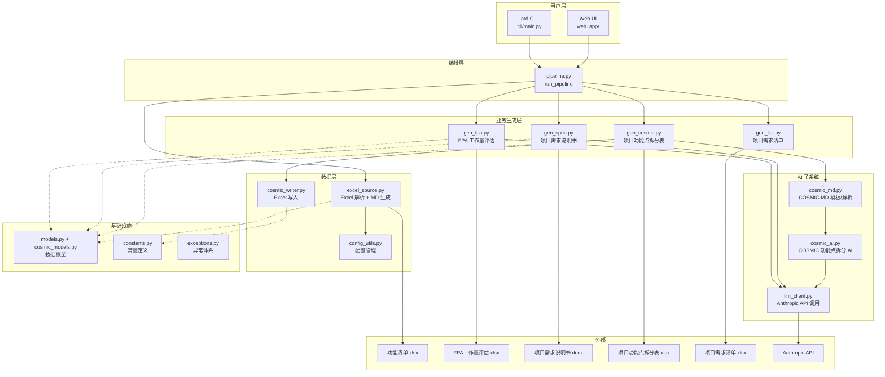
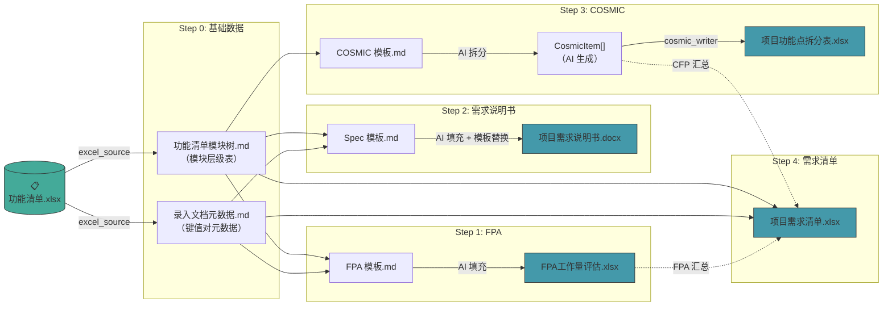
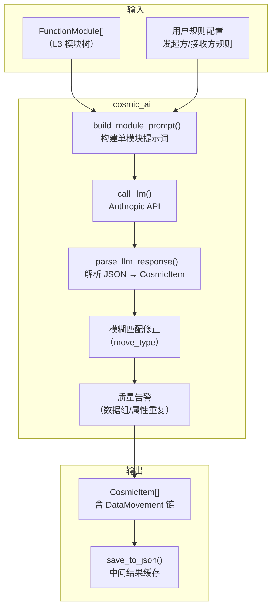
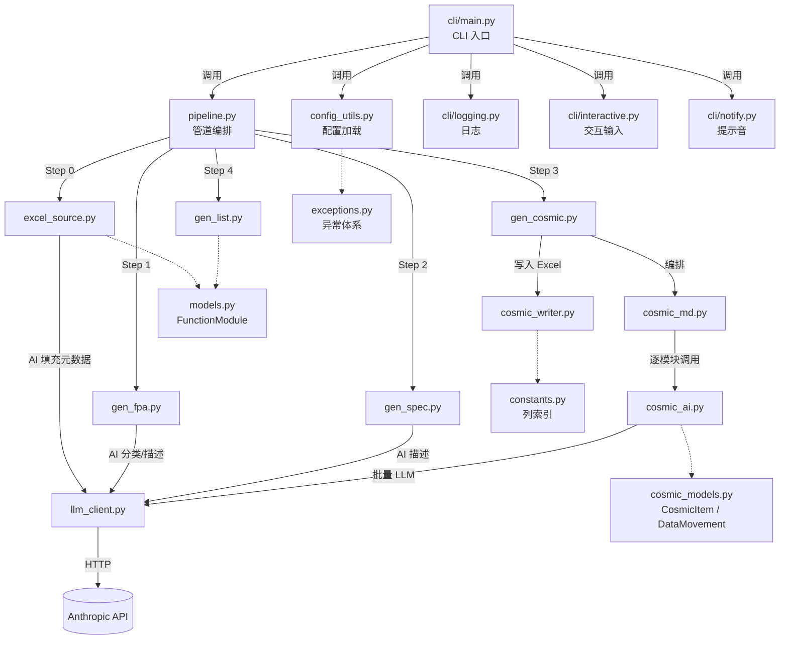
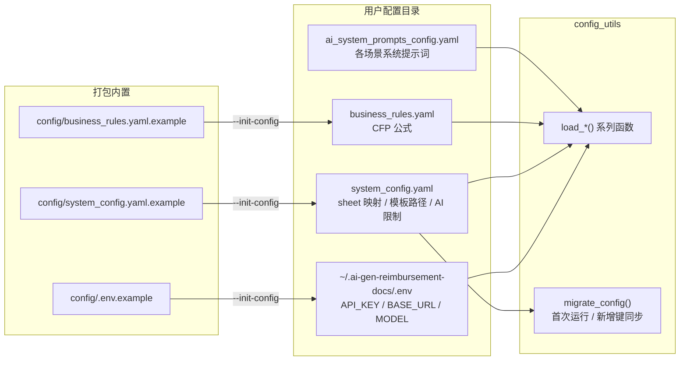
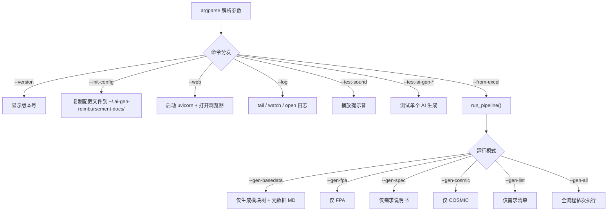

# AI 生成项目报账文档 — 架构图

## 1. 系统整体架构（分层视图）

```mermaid
graph TB
    subgraph 用户层
        CLI[ard CLI<br/>cli/main.py]
        WEB[Web UI<br/>web_app/]
    end

    subgraph 编排层
        PIPE[pipeline.py<br/>run_pipeline]
    end

    subgraph 业务生成层
        GEN_FPA[gen_fpa.py<br/>FPA 工作量评估]
        GEN_SPEC[gen_spec.py<br/>项目需求说明书]
        GEN_COSMIC[gen_cosmic.py<br/>项目功能点拆分表]
        GEN_LIST[gen_list.py<br/>项目需求清单]
    end

    subgraph AI 子系统
        LLM[llm_client.py<br/>Anthropic API 调用]
        COSMIC_AI[cosmic_ai.py<br/>COSMIC 功能点拆分 AI]
        COSMIC_MD[cosmic_md.py<br/>COSMIC MD 模板/解析]
    end

    subgraph 数据层
        EXCEL_SRC[excel_source.py<br/>Excel 解析 + MD 生成]
        COSMIC_WRITER[cosmic_writer.py<br/>Excel 写入]
        CONFIG[config_utils.py<br/>配置管理]
    end

    subgraph 基础设施
        MODELS[models.py + cosmic_models.py<br/>数据模型]
        CONST[constants.py<br/>常量定义]
        EXCEPTIONS[exceptions.py<br/>异常体系]
    end

    subgraph 外部
        IN[功能清单.xlsx]
        OUT_FPA[FPA工作量评估.xlsx]
        OUT_SPEC[项目需求说明书.docx]
        OUT_COSMIC[项目功能点拆分表.xlsx]
        OUT_LIST[项目需求清单.xlsx]
        API[Anthropic API]
    end

    CLI --> PIPE
    WEB --> PIPE
    PIPE --> GEN_FPA
    PIPE --> GEN_SPEC
    PIPE --> GEN_COSMIC
    PIPE --> GEN_LIST
    PIPE --> EXCEL_SRC

    GEN_FPA --> LLM
    GEN_SPEC --> LLM
    GEN_COSMIC --> COSMIC_MD --> COSMIC_AI --> LLM
    GEN_COSMIC --> COSMIC_WRITER

    LLM --> API
    EXCEL_SRC --> IN
    EXCEL_SRC --> CONFIG
    GEN_FPA --> OUT_FPA
    GEN_SPEC --> OUT_SPEC
    GEN_COSMIC --> OUT_COSMIC
    GEN_LIST --> OUT_LIST

    GEN_FPA -.-> MODELS
    GEN_SPEC -.-> MODELS
    GEN_COSMIC -.-> MODELS
    EXCEL_SRC -.-> MODELS
    COSMIC_WRITER -.-> CONST
```

## 2. 核心管道数据流

```mermaid
flowchart LR
    EXCEL[("📋<br/>功能清单.xlsx")]

    subgraph Step0[Step 0: 基础数据]
        MD_TREE["功能清单模块树.md<br/>（模块层级表）"]
        MD_META["录入文档元数据.md<br/>（键值对元数据）"]
    end

    subgraph Step1[Step 1: FPA]
        FPA_MD["FPA 模板.md"]
        FPA_OUT["FPA工作量评估.xlsx"]
    end

    subgraph Step2[Step 2: 需求说明书]
        SPEC_MD["Spec 模板.md"]
        SPEC_OUT["项目需求说明书.docx"]
    end

    subgraph Step3[Step 3: COSMIC]
        COSMIC_MD["COSMIC 模板.md"]
        COSMIC_JSON["CosmicItem[]<br/>（AI 生成）"]
        COSMIC_OUT["项目功能点拆分表.xlsx"]
    end

    subgraph Step4[Step 4: 需求清单]
        LIST_OUT["项目需求清单.xlsx"]
    end

    EXCEL -->|excel_source| MD_TREE
    EXCEL -->|excel_source| MD_META

    MD_TREE --> FPA_MD
    MD_META --> FPA_MD
    MD_TREE --> SPEC_MD
    MD_META --> SPEC_MD
    MD_TREE --> COSMIC_MD

    FPA_MD -->|AI 填充| FPA_OUT
    SPEC_MD -->|AI 填充 + 模板替换| SPEC_OUT
    COSMIC_MD -->|AI 拆分| COSMIC_JSON
    COSMIC_JSON -->|cosmic_writer| COSMIC_OUT

    MD_TREE --> LIST_OUT
    MD_META --> LIST_OUT
    COSMIC_JSON -.->|CFP 汇总| LIST_OUT
    FPA_OUT -.->|FPA 汇总| LIST_OUT

    style EXCEL fill:#4a9,stroke:#333
    style FPA_OUT fill:#49a,stroke:#333
    style SPEC_OUT fill:#49a,stroke:#333
    style COSMIC_OUT fill:#49a,stroke:#333
    style LIST_OUT fill:#49a,stroke:#333
```

## 3. COSMIC AI 子系统详解

```mermaid
flowchart TB
    subgraph 输入
        MODULES["FunctionModule[]<br/>（L3 模块树）"]
        CONFIG2["用户规则配置<br/>发起方/接收方规则"]
    end

    subgraph cosmic_ai
        BUILD_PROMPT["_build_module_prompt()<br/>构建单模块提示词"]
        CALL_LLM["call_llm()<br/>Anthropic API"]
        PARSE["_parse_llm_response()<br/>解析 JSON → CosmicItem"]
        CORRECT["模糊匹配修正<br/>（move_type）"]
        WARN["质量告警<br/>（数据组/属性重复）"]
    end

    subgraph 输出
        ITEMS["CosmicItem[]<br/>含 DataMovement 链"]
        SAVE_JSON["save_to_json()<br/>中间结果缓存"]
    end

    MODULES --> BUILD_PROMPT
    CONFIG2 --> BUILD_PROMPT
    BUILD_PROMPT --> CALL_LLM
    CALL_LLM --> PARSE
    PARSE --> CORRECT
    CORRECT --> WARN
    WARN --> ITEMS
    ITEMS --> SAVE_JSON
```

## 4. 模块依赖关系（类图风格）

```mermaid
graph TD
    MAIN["cli/main.py<br/>CLI 入口"] -->|"调用"| PIPE2["pipeline.py<br/>管道编排"]
    MAIN -->|"调用"| CONFIG3["config_utils.py<br/>配置加载"]
    MAIN -->|"调用"| LOG["cli/logging.py<br/>日志"]
    MAIN -->|"调用"| INTERACT["cli/interactive.py<br/>交互输入"]
    MAIN -->|"调用"| NOTIFY["cli/notify.py<br/>提示音"]

    PIPE2 -->|"Step 0"| EXCEL2["excel_source.py"]
    PIPE2 -->|"Step 1"| GEN_FPA2["gen_fpa.py"]
    PIPE2 -->|"Step 2"| GEN_SPEC2["gen_spec.py"]
    PIPE2 -->|"Step 3"| GEN_COSMIC2["gen_cosmic.py"]
    PIPE2 -->|"Step 4"| GEN_LIST2["gen_list.py"]

    EXCEL2 -->|"AI 填充元数据"| LLM2["llm_client.py"]
    GEN_FPA2 -->|"AI 分类/描述"| LLM2
    GEN_SPEC2 -->|"AI 描述"| LLM2
    GEN_COSMIC2 -->|"编排"| COSMIC_MD2["cosmic_md.py"]
    COSMIC_MD2 -->|"逐模块调用"| COSMIC_AI2["cosmic_ai.py"]
    COSMIC_AI2 -->|"批量 LLM"| LLM2
    GEN_COSMIC2 -->|"写入 Excel"| WRITER["cosmic_writer.py"]

    LLM2 -->|"HTTP"| ANTHROPIC[("Anthropic API")]

    EXCEL2 -.-> MODELS2["models.py<br/>FunctionModule"]
    COSMIC_AI2 -.-> COSMIC_MODELS["cosmic_models.py<br/>CosmicItem / DataMovement"]
    GEN_LIST2 -.-> MODELS2
    WRITER -.-> CONSTANTS["constants.py<br/>列索引"]
    CONFIG3 -.-> EXCEPTIONS2["exceptions.py<br/>异常体系"]
```

## 5. 配置加载链路

```mermaid
flowchart LR
    subgraph 用户配置目录
        ENV["~/.ai-gen-reimbursement-docs/.env<br/>API_KEY / BASE_URL / MODEL"]
        SYS["system_config.yaml<br/>sheet 映射 / 模板路径 / AI 限制"]
        BIZ["business_rules.yaml<br/>CFP 公式"]
        AI_PROMPT["ai_system_prompts_config.yaml<br/>各场景系统提示词"]
    end

    subgraph 打包内置
        TMPL_ENV["config/.env.example"]
        TMPL_SYS["config/system_config.yaml.example"]
        TMPL_BIZ["config/business_rules.yaml.example"]
    end

    subgraph config_utils
        LOAD["load_*() 系列函数"]
        MIGRATE["migrate_config()<br/>首次运行 / 新增键同步"]
    end

    TMPL_ENV -->|"--init-config"| ENV
    TMPL_SYS -->|"--init-config"| SYS
    TMPL_BIZ -->|"--init-config"| BIZ

    ENV --> LOAD
    SYS --> LOAD
    BIZ --> LOAD
    AI_PROMPT --> LOAD
    SYS --> MIGRATE
```

## 6. CLI 命令分发

```mermaid
flowchart TD
    ARGS["argparse 解析参数"] --> DISPATCH{命令分发}

    DISPATCH -->|"--version"| VER["显示版本号"]
    DISPATCH -->|"--init-config"| INIT["复制配置文件到 ~/.ai-gen-reimbursement-docs/"]
    DISPATCH -->|"--web"| WEB2["启动 uvicorn + 打开浏览器"]
    DISPATCH -->|"--log"| LOG2["tail / watch / open 日志"]
    DISPATCH -->|"--test-sound"| SOUND["播放提示音"]
    DISPATCH -->|"--test-ai-gen-*"| TEST["测试单个 AI 生成"]
    DISPATCH -->|"--from-excel"| PIPE3["run_pipeline()"]

    PIPE3 --> MODE{运行模式}
    MODE -->|"--gen-basedata"| BASE["仅生成模块树 + 元数据 MD"]
    MODE -->|"--gen-fpa"| FPA["仅 FPA"]
    MODE -->|"--gen-spec"| SPEC["仅需求说明书"]
    MODE -->|"--gen-cosmic"| COSMIC["仅 COSMIC"]
    MODE -->|"--gen-list"| LIST["仅需求清单"]
    MODE -->|"--gen-all"| ALL["全流程依次执行"]
```
